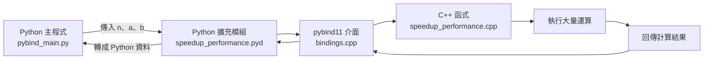

<style>
    .reveal {
        font-family: 'Times New Roman', '標楷體';
        font-size: 30px;
        text-align: left;
        color: black;
        background-size: cover;
        background-position: center;
    }
    .reveal h1,
    .reveal h2,
    .reveal h3,
    .reveal h4,
    .reveal h5,
    .reveal h6 {
        font-family: 'Times New Roman', '標楷體';
        color: black;
        text-transform: capitalize;
    }
    .with-border {
        border: 1px solid red;
    }
</style>

<grid drag="100 10" drop="0 40">
Class3.5：Functionalization and API, write your own library with pybind11
<!-- element style="background-color: black; font-size: 60px;align: left; text-align: middle;color: white"-->
</grid>

<grid drag="50 10" drop="40 70">
TA: 賴宏達\
eddlai.be10@nycu.edu.tw
<!-- element style="background-color: black;font-size: 40px;align: right; text-align: right;color: white"-->
</grid>

<!-- slide bg="[[MSP430 HD pic.png]]" -->

---
# Functionalization

把程式的功能用 function 包起來，方便閱讀、重複使用與維護。（特別是當程式碼超過幾百行時）

Why are we using C++ instead of Python or Java?\
開發不能出錯且需要高效能的應用時，通常需要使用資料型別與編譯規則更嚴謹的語言。

---
# C 編譯器

![[C compiler process.png]]

Ref: [Compilation Process in C Language: 4 steps to follow](https://tutorialadda.com/embedded-systems/c-program-compilation-step#google_vignette)

---
# 舉例：函式

Uber Eats 或 Foodpanda 送出訂單：

```cpp
food food_order(food_category, deliver_platform) {
    if (deliver_platform == "UberEats") {
        result = UberEats(food_category);       // 呼叫 UberEats API
    } else if (deliver_platform == "Foodpanda") {
        result = Foodpanda(food_category);      // 呼叫 Foodpanda API
    } else {
        result = "Unknown delivery platform";  // 防呆
    }

    return result;
}
```

API 是 Application Programming Interface（應用程式介面）。

例如：金融 API、馬達控制 API、高階語法 `digitalWrite(gpio, LEVEL)`。

---
# API 的背後

API 的後端可能是一個複雜的函式：

```cpp
food UberEats(string food_category) {
    vector<string> process_steps = {
        "製作食物",
        "包裝食物",
        "配送中"
    };

    for (string step : process_steps) {
        cout << "[UberEats] "
             << step
             << "中："
             << food_category
             << endl;
    }
}
```

---
# pybind11

pybind11 是一套用來連接 Python 與 C++ 的函式庫。

它的主要功能是：

- 將 C++ 函式公開給 Python 使用。
- 自動轉換 Python 與 C++ 之間的資料型別。
- 將 C++ 程式編譯成 Python 可以 `import` 的擴充模組。
- 讓耗時運算由 C++ 執行，再把結果傳回 Python。

簡單來說：

> Python 負責操作，pybind11 負責連接，C++ 負責高速運算。

---
# 安裝環境

1. 安裝 Python，或使用 Anaconda。
2. 確認 Python 可以使用：

```powershell
python --version
```

3. 安裝 pybind11：

```powershell
python -m pip install pybind11
```

4. 確認 pybind11 已安裝：

```powershell
python -m pybind11 --includes
```

5. Windows 安裝 Visual Studio Build Tools，並勾選：
   - 使用 C++ 的桌面開發
   - MSVC C++ x64/x86 建置工具
   - Windows SDK
6. 確認 C++ 編譯器可以使用。

---
# C++ 函式宣告

`speedup_performance.h`

```cpp
#ifndef SPEEDUP_PERFORMANCE_H
#define SPEEDUP_PERFORMANCE_H

#include <cstdint>

int calc(int x, int a, int b);
std::int64_t loop_in_cpp(int n, int a, int b);

#endif
```

---
# C++ 函式實作

`speedup_performance.cpp`

```cpp
#include "speedup_performance.h"

int calc(int x, int a, int b)
{
    return a * x + b;
}

std::int64_t loop_in_cpp(int n, int a, int b)
{
    std::int64_t total = 0;

    for (int i = 0; i < n; ++i)
    {
        total += calc(i, a, b);
    }

    return total;
}
```

---
# pybind11 介面

`bindings.cpp` 是 Python 與 C++ 之間的橋樑：

```cpp
#include <pybind11/pybind11.h>
#include "speedup_performance.h"

namespace py = pybind11;

PYBIND11_MODULE(speedup_performance, module)
{
    module.doc() = "C++ performance example using pybind11";

    module.def(
        "calc",
        &calc,
        py::arg("x"),
        py::arg("a"),
        py::arg("b")
    );

    module.def(
        "loop_in_cpp",
        &loop_in_cpp,
        py::arg("n"),
        py::arg("a"),
        py::arg("b")
    );
}
```

---
# 編譯設定

`setup.py`

```python
from setuptools import setup
from pybind11.setup_helpers import Pybind11Extension, build_ext

extensions = [
    Pybind11Extension(
        "speedup_performance",
        [
            "bindings.cpp",
            "speedup_performance.cpp",
        ],
        cxx_std=17,
        extra_compile_args=["/O2"],
    ),
]

setup(
    name="speedup_performance",
    version="1.0.0",
    ext_modules=extensions,
    cmdclass={"build_ext": build_ext},
)
```

> `/O2` 是 MSVC 的速度最佳化選項。其他作業系統可依照所使用的編譯器調整。

---
# 編譯 pybind11 模組

1. 使用 Terminal 移動到專案資料夾。
2. 確認資料夾中存在：
   - `speedup_performance.h`
   - `speedup_performance.cpp`
   - `bindings.cpp`
   - `setup.py`
3. 執行：

```powershell
python setup.py build_ext --inplace
```

4. 編譯成功後，Windows 會產生類似以下檔案：

```text
speedup_performance.cp313-win_amd64.pyd
```

其中：

- `cp313` 代表 Python 3.13。
- `win_amd64` 代表 64 位元 Windows。
- `.pyd` 是 Windows 的 Python C/C++ 擴充模組。

---
# 在 Python 呼叫 C++

`pybind_main.py`

```python
import time
import speedup_performance

n = 100_000_000
a = 2
b = 3

start = time.perf_counter()
result = speedup_performance.loop_in_cpp(n, a, b)
elapsed = time.perf_counter() - start

print("pybind11 result:", result)
print("pybind11 time:", elapsed, "seconds")
```

執行：

```powershell
python pybind_main.py
```

---
# pybind11 Block Diagram



---
# 測速指令

## Windows PowerShell

```powershell
Measure-Command { python main.py }
Measure-Command { .\main.exe }
Measure-Command { python pybind_main.py }
```

## macOS／Linux

```bash
time python3 main.py
time ./main
time python3 pybind_main.py
```

比較時，三個版本必須使用：

- 相同的運算公式
- 相同的迴圈次數
- 相同的輸入參數
- 相同的編譯最佳化設定說明

---
# 完成後的專案檔案

```text
functionalization_pybind/
├── build/
├── bindings.cpp
├── main.cpp
├── main.exe
├── main.py
├── pybind_main.py
├── setup.py
├── speedup_performance.cpp
├── speedup_performance.h
└── speedup_performance.cp3xx-win_amd64.pyd
```

各檔案功能：

| 檔案 | 功能 |
|---|---|
| `main.py` | 純 Python 效能測試 |
| `main.cpp` | 純 C++ 效能測試 |
| `speedup_performance.h` | 宣告 C++ 函式 |
| `speedup_performance.cpp` | 實作 C++ 運算 |
| `bindings.cpp` | 建立 pybind11 介面 |
| `setup.py` | 設定 Python 擴充模組的編譯方式 |
| `pybind_main.py` | 從 Python 呼叫 C++ 函式 |
| `.pyd` | 編譯完成的 Python C++ 擴充模組 |

---
# 今日 Tasks

- 把提供的檔案放到同一個專案資料夾。
- 安裝 Python、pybind11 與 C++ Build Tools。
- 根據 `.h` 函式宣告完成 C++ 實作。
- 使用 `bindings.cpp` 建立 pybind11 介面。
- 使用 `setup.py` 編譯 Python C++ 擴充模組。
- 從 Python 呼叫 C++ API。
- 實測純 Python、純 C++ 與 Python＋pybind11 的迴圈速度差異。
- 確認三種版本的計算結果一致。

---
# Homework

- 畫出 pybind11 所使用檔案的 Block Diagram。
- 說明 `bindings.cpp` 的功能。
- 說明 `.pyd` 檔案的用途。
- 實測純 Python、純 C++ 與 pybind11 的速度差異。
- 討論為什麼 pybind11 速度接近 C++，但仍可能存在額外呼叫成本。
- 修改 C++ 模組與 Python `import` 時使用的名稱。
- 新增一個不同的耗時計算，並比較三種版本的結果與速度。
- 嘗試傳遞不同資料型別，例如整數、浮點數、字串或陣列。

（之後幾堂課會整合在一起）

---
# Ref.

- [pybind11 documentation](https://pybind11.readthedocs.io/)
- [pybind11 GitHub repository](https://github.com/pybind/pybind11)
- [Building C and C++ Extensions](https://docs.python.org/3/extending/building.html)
- [setuptools documentation](https://setuptools.pypa.io/)

---

有完成就 25 分
